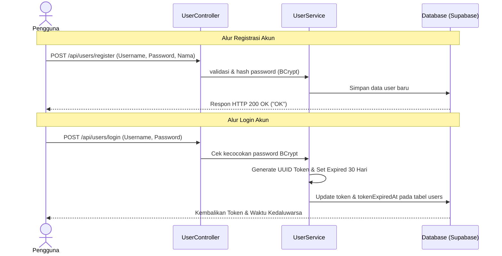
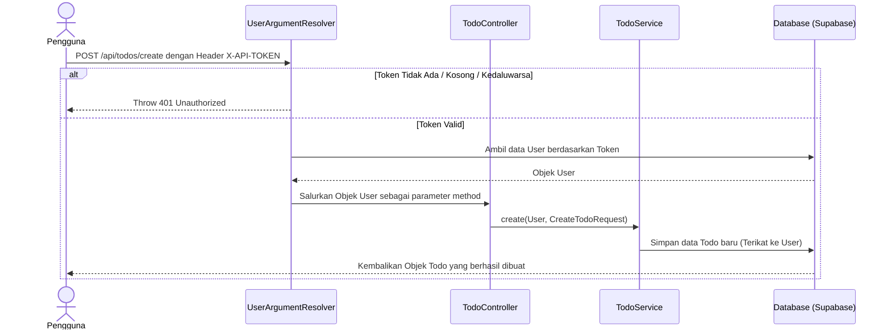

# RESTful API Todo List (Spring Boot, Supabase, & Redis)

Proyek ini adalah implementasi RESTful API backend menggunakan **Java Spring Boot**, terintegrasi dengan **PostgreSQL (Supabase)** sebagai basis data utama dan **Redis** untuk manajemen sesi atau *caching*. Aplikasi ini menyediakan layanan manajemen pengguna (*user management*) serta pengelolaan daftar tugas (*todo list*) yang aman dengan autentikasi berbasis token kustom.

---

## 🛠️ Teknologi yang Digunakan

*   **Runtime & Language**: Java 21
*   **Framework**: Spring Boot 4.1.0
*   **Database**: PostgreSQL (Supabase cloud / Lokal via Docker)
*   **Object-Relational Mapping (ORM)**: Spring Data JPA & Hibernate
*   **Caching & Session**: Redis
*   **Security & Encryption**: Spring Security Crypto (BCrypt)
*   **Boilerplate Reducer**: Lombok
*   **Containerization**: Docker & Docker Compose
*   **Testing**: JUnit 5, MockMvc, & H2 Database (untuk test terisolasi)
*   **Frontend Integration**: React.js & Vite (untuk pengembangan antarmuka pengguna)

---

## 📋 Fitur Utama

1.  **Manajemen Pengguna (User Management)**:
    *   Registrasi akun baru (Password disimpan dalam bentuk hash BCrypt).
    *   Masuk (*Login*) untuk mendapatkan token autentikasi (Masa aktif token 30 hari).
    *   Mendapatkan profil pengguna yang sedang masuk.
    *   Memperbarui nama atau password pengguna.
    *   Keluar (*Logout*) untuk menghapus/menonaktifkan token.
    *   Daftar seluruh pengguna terdaftar (Hanya untuk keperluan administratif/internal).
2.  **Manajemen Tugas (Todo List)**:
    *   Membuat tugas baru (Setiap tugas terikat secara spesifik ke pengguna yang membuatnya).
    *   Melihat seluruh daftar tugas milik pengguna yang sedang masuk.
    *   Melihat rincian tugas berdasarkan ID tugas.
    *   Memperbarui data tugas (Judul, deskripsi, status, dan tenggat waktu).
    *   Menghapus tugas berdasarkan ID tugas.

---

## 🔄 Alur Kerja Aplikasi (Application Flow)

Aplikasi ini menggunakan mekanisme autentikasi berbasis token kustom yang dikirimkan melalui HTTP Header `X-API-TOKEN`.

### 1. Alur Registrasi & Login Pengguna



### 2. Alur Pengaksesan API Terproteksi (Contoh: Membuat Todo Baru)

Setiap request ke endpoint yang memerlukan autentikasi diproses terlebih dahulu oleh `UserArgumentResolver` untuk mencocokkan token di database.



---

## 🗄️ Skema Database (Database Schema)

Aplikasi memiliki dua tabel yang saling terhubung dengan relasi *One-to-Many* (Satu pengguna dapat memiliki banyak todo).

### 1. Tabel `users`
Tabel untuk menyimpan informasi akun pengguna dan session token aktif.
*   `username` (VARCHAR, Primary Key) - Username unik pengguna.
*   `password` (VARCHAR, Not Null) - Hash password BCrypt.
*   `name` (VARCHAR, Not Null) - Nama lengkap pengguna.
*   `token` (VARCHAR, Nullable) - Token sesi aktif (UUID).
*   `token_expired_at` (BIGINT, Nullable) - Waktu kedaluwarsa token (Milidetik).

### 2. Tabel `todos`
Tabel untuk menyimpan daftar tugas. Menggunakan penamaan kolom berbahasa Indonesia untuk kejelasan semantik lokal.
*   `id` (BIGINT, Primary Key, Auto-increment) - ID unik tugas.
*   `judul` (VARCHAR, Not Null) - Judul tugas.
*   `deskripsi` (TEXT) - Deskripsi lengkap tugas.
*   `status` (VARCHAR, Not Null) - Status pengerjaan (Default: `TODO`).
*   `tenggat_waktu` (DATE) - Tanggal batas akhir penyelesaian.
*   `username` (VARCHAR, Foreign Key) - Pemilik tugas (Merujuk ke `users.username`).
*   `dibuat_pada` (TIMESTAMP) - Tanggal & waktu pembuatan record.
*   `diperbarui_pada` (TIMESTAMP) - Tanggal & waktu pembaruan record terakhir.

---

## 🚀 Cara Menjalankan Aplikasi

### Persyaratan Sistem
*   Java Development Kit (JDK) 21
*   Maven 3.9+ (atau gunakan `mvnw` bawaan proyek)
*   Docker & Docker Compose (opsional, untuk menjalankan PostgreSQL & Redis lokal)

### Langkah 1: Konfigurasi Environment
Secara default, aplikasi dikonfigurasi untuk terhubung ke Supabase & Redis Cloud yang sudah didefinisikan di berkas [application.properties](file:///Users/indra/Development/Java/restfull-api-supabase/src/main/resources/application.properties). Anda bisa mengubahnya dengan mengatur Environment Variables berikut di sistem Anda atau di berkas `.env`:

```env
SPRING_DATASOURCE_URL=jdbc:postgresql://localhost:5433/restfull_db
SPRING_DATASOURCE_USERNAME=postgres
SPRING_DATASOURCE_PASSWORD=password123
SPRING_DATA_REDIS_HOST=localhost
SPRING_DATA_REDIS_PORT=6379
PORT=8080
```

### Langkah 2: Menjalankan Database & Redis Lokal (Opsional)
Jika ingin menggunakan basis data lokal daripada cloud, jalankan Docker Compose di root direktori proyek:
```bash
docker compose up -d
```
*Ini akan menyalakan PostgreSQL di port `5433` dan Redis di port `6379`.*

### Langkah 3: Menjalankan Aplikasi
Jalankan perintah berikut untuk mengunduh dependensi, mengompilasi, dan memulai server Spring Boot:
```bash
./mvnw spring-boot:run
```
Aplikasi akan berjalan di port `8080` (atau port yang didefinisikan pada env variable `PORT`).

### Langkah 4: Menjalankan Unit Tests
Untuk memastikan seluruh fitur berfungsi dengan baik tanpa ada regresi:
```bash
./mvnw clean test
```

---

## 🔌 Uji Coba API (API Testing)

Anda dapat mengimpor berkas koleksi Postman yang telah disediakan di root proyek untuk mempermudah proses pengujian:
📁 [postman_collection.json](file:///Users/indra/Development/Java/restfull-api-supabase/postman_collection.json)

Koleksi tersebut mencakup request untuk:
*   Mendaftarkan pengguna baru.
*   Melakukan login untuk memperoleh token.
*   Melakukan operasi CRUD pada Todo dengan header token terotomatisasi.
*   Melakukan pembaruan profil dan keluar dari sesi.

---

## 💻 Integrasi Frontend (React.js & Vite)

Untuk mengintegrasikan backend ini dengan aplikasi frontend Anda yang dibangun menggunakan **React.js** dan **Vite**, berikut adalah beberapa panduan dasarnya:

### 1. Inisialisasi Proyek React + Vite
Jalankan perintah berikut untuk membuat proyek frontend baru:
```bash
npm create vite@latest frontend-todo -- --template react
cd frontend-todo
npm install
npm install axios
```

### 2. Contoh Request API menggunakan Axios
Gunakan kode berikut untuk melakukan autentikasi dan mengakses RESTful API ini.

#### A. Melakukan Login dan Menyimpan Token
```javascript
import axios from 'axios';

// URL dasar API backend
const API_URL = 'http://localhost:8080/api';

export const loginUser = async (username, password) => {
    try {
        const response = await axios.post(`${API_URL}/users/login`, {
            username,
            password
        });
        
        // Simpan token ke localStorage untuk request selanjutnya
        if (response.data.token) {
            localStorage.setItem('x_api_token', response.data.token);
        }
        return response.data;
    } catch (error) {
        console.error("Login gagal: ", error.response?.data?.errors || error.message);
        throw error;
    }
};
```

#### B. Mengambil Daftar Todo (Mengirimkan Token di Header)
```javascript
export const getTodoList = async () => {
    try {
        const token = localStorage.getItem('x_api_token');
        const response = await axios.get(`${API_URL}/todos/list`, {
            headers: {
                'X-API-TOKEN': token
            }
        });
        return response.data.data; // Mengambil array todo dari response
    } catch (error) {
        console.error("Gagal mengambil data todo: ", error.response?.data?.errors || error.message);
        throw error;
    }
};
```

#### C. Membuat Tugas Baru (POST dengan Token & Request Body)
```javascript
export const createTodo = async (judul, deskripsi, tenggatWaktu) => {
    try {
        const token = localStorage.getItem('x_api_token');
        const response = await axios.post(
            `${API_URL}/todos/create`,
            {
                title: judul,          // Dipetakan ke judul di backend DTO
                description: deskripsi, // Dipetakan ke deskripsi
                status: "TODO",
                deadline: tenggatWaktu  // Format: "YYYY-MM-DD"
            },
            {
                headers: {
                    'X-API-TOKEN': token
                }
            }
        );
        return response.data.data;
    } catch (error) {
        console.error("Gagal membuat tugas: ", error.response?.data?.errors || error.message);
        throw error;
    }
};
```

### 3. Konfigurasi Proxy di Vite (Menghindari CORS di Lokal)
Pada berkas `vite.config.js` di folder React Anda, tambahkan konfigurasi proxy agar request ke `/api` diarahkan otomatis ke backend Spring Boot di port `8080`:
```javascript
import { defineConfig } from 'vite';
import react from '@vitejs/plugin-react';

export default defineConfig({
    plugins: [react()],
    server: {
        proxy: {
            '/api': {
                target: 'http://localhost:8080',
                changeOrigin: true,
                secure: false
            }
        }
    }
});
```
*Dengan proxy ini, Anda cukup melakukan request ke path lokal seperti `axios.post('/api/users/login', ...)` tanpa khawatir diblokir oleh kebijakan CORS browser.*

---

## 📂 Struktur Berkas Utama

Untuk mempermudah navigasi kode, berikut adalah tautan langsung ke berkas-berkas penting dalam proyek:
*   **Konfigurasi**:
    *   [pom.xml](file:///Users/indra/Development/Java/restfull-api-supabase/pom.xml) - Pengaturan dependencies Maven.
    *   [application.properties](file:///Users/indra/Development/Java/restfull-api-supabase/src/main/resources/application.properties) - Konfigurasi koneksi database & Redis.
*   **Model Data (Entity)**:
    *   [User.java](file:///Users/indra/Development/Java/restfull-api-supabase/src/main/java/supabase/restfull_api/entity/User.java) - Struktur tabel pengguna.
    *   [Todo.java](file:///Users/indra/Development/Java/restfull-api-supabase/src/main/java/supabase/restfull_api/entity/Todo.java) - Struktur tabel tugas.
*   **Logika Bisnis & API**:
    *   [TodoService.java](file:///Users/indra/Development/Java/restfull-api-supabase/src/main/java/supabase/restfull_api/service/TodoService.java) & [TodoController.java](file:///Users/indra/Development/Java/restfull-api-supabase/src/main/java/supabase/restfull_api/controller/TodoController.java) - Operasi Todo.
    *   [UserService.java](file:///Users/indra/Development/Java/restfull-api-supabase/src/main/java/supabase/restfull_api/service/UserService.java) & [UserController.java](file:///Users/indra/Development/Java/restfull-api-supabase/src/main/java/supabase/restfull_api/controller/UserController.java) - Autentikasi & manajemen pengguna.
    *   [UserArgumentResolver.java](file:///Users/indra/Development/Java/restfull-api-supabase/src/main/java/supabase/restfull_api/config/UserArgumentResolver.java) - Interceptor validasi token request.
*   **Pengujian Terintegrasi (Tests)**:
    *   [TodoControllerTest.java](file:///Users/indra/Development/Java/restfull-api-supabase/src/test/java/supabase/restfull_api/controller/TodoControllerTest.java) - Skenario uji coba API Todo.
    *   [UserControllerTest.java](file:///Users/indra/Development/Java/restfull-api-supabase/src/test/java/supabase/restfull_api/controller/UserControllerTest.java) - Skenario uji coba API User.
*   **Layanan Virtualisasi**:
    *   [docker-compose.yml](file:///Users/indra/Development/Java/restfull-api-supabase/docker-compose.yml) - Orkestrasi database & Redis lokal.
    *   [Dockerfile](file:///Users/indra/Development/Java/restfull-api-supabase/Dockerfile) - Blueprint docker build.
